# **CSDS302 HW1 - Trevor Swan (*tcs94*)**
# **Section 1.2**
## Problem 3
#### a. Is $4 = \set4$?
No, because number while {4} is a set containing 4.
#### b. How many elements are in the set $\set{3, 4, 3, 5}$?
There are 3 elements in the set. 3 is repeated, but it only counts as one element.
#### c. How many elements are in the set $\set{1, \set{1}, \set{1, \set{1}}}$?
This set has 3 distinct elements, 2 of which are sets while one is a number.

## Problem 6
#### For any integer $n$, let $T_n = \set{n, n^2}$. How many elements are in each of $T_2$, $T_{-3}$, $T_1$, and $T_0$? Justify your answers.
There are 2 elements in ${T_2}$ and ${T_{-3}}$, ${T_2 = \set{2, 4}}$ and ${T_-3 = \set{-3, 9}}$. ${T_1}$ has one element, though it repeated once. ${T_0}$ is an empty set ${\set{0,0}}$ containing one element.

## Problem 7
#### Use the set-roster notation to indicate the elements in each of the following sets.
#### a. $S$ = {${{n \in \mathbb{Z} \ | \ n = (-1)^k}, for\ some\ integer \ k}$}.
${-1^1 = -1,-1^2 = 1, -1^3 = -1\  \therefore}$  ${S = \set{-1, 1}}$.
#### e. $W$ = {${s \in \mathbb{Z} \  | \  1 < t < -3}$}
${1 \lt t \lt -3}$ is not valid as ${-3 \lt 1}$.
  
#### f. $X$ = {${u \in \mathbb{Z} \ |\ u \le 4}$ $or$ ${u \ge 1}$}
${u \le 4}$ and ${u \ge 1}$ encompasses all integer values ${\therefore \ X = \mathbb{Z}}$.

## Problem 9
#### c. Is ${\set{2} \in \set{1, 2}}$?
No, ${\set{1,2}}$ contains the numbers 1 and 2, but {2} is a set ${\therefore}$ ${\set{2} \notin \set{1, 2}}$.
#### g. is ${\set{1} \subseteq \set{1, 2}}$?
Yes, ${\set{1,2}}$ contains the numbers 1 and 2, so it has the subset ${\set{1}}\therefore$ ${\set{1} \subseteq \set{1,2}}$.

## Problem 10
#### b. Is ${(5,-5) = (-5,5)}$?
No, mirrors of coordinates ${(a,b)}$ where ${a \not= b}$ are not equivalent as they amp to different regions in a plane
#### d. Is (${(\frac{-2}{-4},(-2)^3 = (\frac{3}{6}, -8)}$)?
Yes, both simplify to ${(\frac{1}{2},-8)}$.

## Problem 12
#### Let ${S = \set{2, 4, 6}}$ and ${T = \set{1, 3, 5}}$. Use the set roster notation to write each of the following sets, and indicate the number of elements that are in each set.
#### a. ${S\ X\ T}$
${= \set{(2,1), (2,3), (2,5), (4,1), (4,3), (4,5), (6,1), (6,3), (6,5)}}$
#### c. ${S\ X\ S}$
${= \set{(2,2), (2,4), (2,6), (4,2), (4,4), (4,6), (6,2), (6,4), (6,6)}}$
    
# **Section 1.3**
## Problem 2
#### Let ${C = D = \set{-3, -2, -1, 1, 2, 3}}$ and define a relation S from C to D as follows. For every ${(x,y) \in C\ X\ D, (x,y) \in S}$ means that ${\frac{1}{x} - \frac{1}{y}}$ is an integer.
#### a. Is ${2\ S\ 2}$? Is ${-1\ S\ \mathbb{-}1}$? Is ${(3,3) \in S}$? Is ${(3,-3) \in S}$?
${(2,2):\frac{1}{2}-\frac{1}{2} = 0\in \mathbb{Z}}$, yes
${(-1,-1):\frac{1}{-1}-\frac{1}{-1} = 0\in \mathbb{Z}}$, yes
${(3,3):\frac{1}{3}-\frac{1}{3} = 0\in \mathbb{Z}}$, yes
${(3,-3):\frac{1}{3}-\frac{1}{-3} = \frac{2}{3}\notin \mathbb{Z}}$, no
#### b. Write ${S}$ as a set of ordered pairs.
${(x,y)\in C\ X\ D \therefore S =}$ 
${\set{(-3,-3),\ (-2,-2),\ (-1,-1),\ (1,1),\ (2,2),\ (3,3),\ (-2,-2),\ (2,-2),\ (1,-1),\ (-1,1)}}$ 
#### c. Write the domain and co-domain of ${S}$.
Domain: ${\set{-3, -2, -1, 1, 2, 3}}$
Co-domain: ${\set{-3, -2, -1, 1, 2, 3}}$
                  
#### d. Draw an arrow diagram for ${S}$.
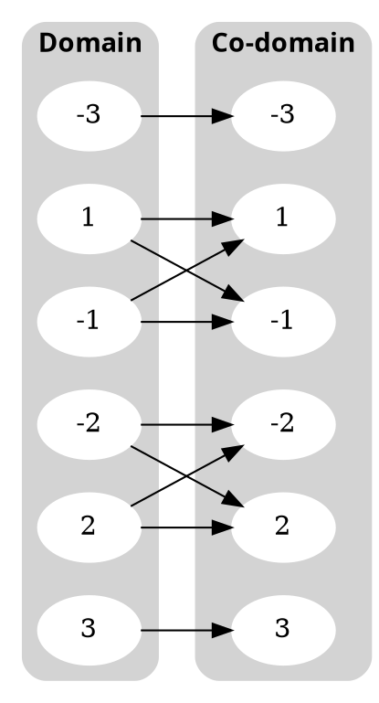

## Problem 8
#### Let ${A = \set{2,4}}$ and ${B = \set{1,3,5}}$ and define relations U, V, and W from A to B as follows: 
##### For every ${(x,y) \in A\ X\ B}$
- ###### ${(x,y) \in U}$ means that ${y-x > 2}$
- ###### ${(x,y) \in V}$ means that ${y-1 = \frac{x}{2}}$
- ###### ${W = \set{(2,5),(4,1),(2,3)}}$
   
#### a. Draw Arrow Diagrams for U, V, and W.
${A = \set{2,4}}$ and ${B = \set{1, 3, 5}}$
**For Relation U:** ${y-x>2 \therefore R_U = \set{(2,5)}}$. 
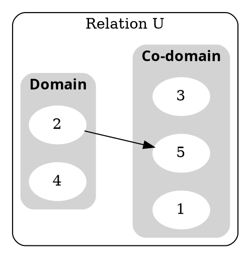
**For Relation V:** ${y-1>\frac{x}{2} \therefore R_V = \set{(4,3)}}$. 
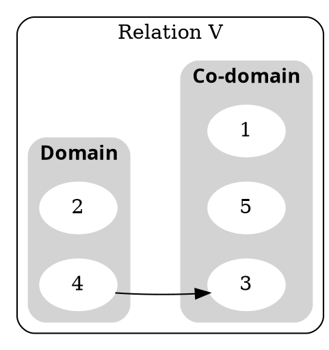
    
**For Relation W:** ${\set{(2,5),(4,1),(2,3)}}$. 
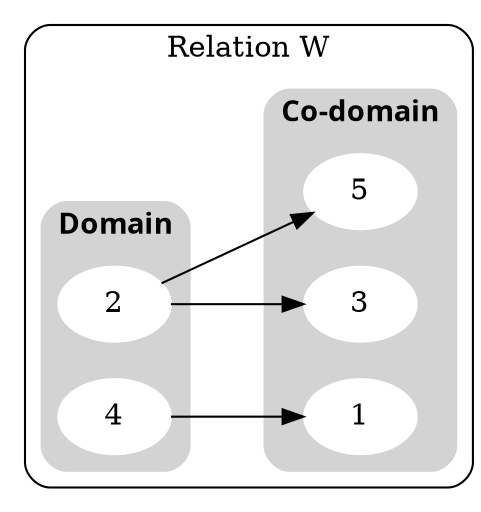
#### b. Indicate whether any of the relations U, V, and W are functions.
Functions require the elements of the domain to be mapped to an element in the co-domain. Relations U and V are not functions because they violate this rule. W is not a function because the element 2 has two mapped elements, ${\set{(2,3),(2,5)}}$.
                  
## Problem 13
#### Let ${A = \set{-1, 0, 1}}$ and ${B = \set{t, u, v, w}}$. Define a function ${F:A \rightarrow B}$ by the following arrow diagram:
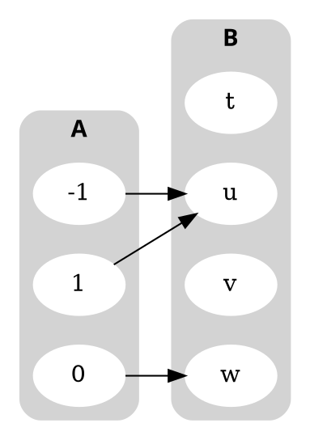
#### a. Write the domain and co-domain of F.
Domain = ${\set{-1,0,1}}$
Co-domain = ${\set{t,u,v,w}}$
#### b. Find ${F(-1), F(0)}$ and ${F(1)}$.
By the arrow diagram, we can see that ${F(-1) = u, F(0) = w}$ and ${F(1) = u}$. The input of F represents the preimage to a corresponding image.
           
## Problem 14
#### Let ${C = \set{1,2,3,4}}$ and ${D = \set{a,b,c,d}}$. Define a function ${G: C \rightarrow D}$ by the following arrow diagram: 
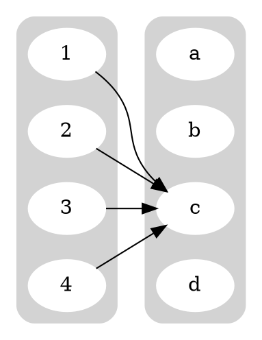
#### a. Write the domain and co-domain of G.
Domain = ${\set{1,2,3,4}}$
Co-domain = ${\set{a, b, c, d}}$
#### b. Find ${G(1), G(2), G(3),}$ and ${G(4)}$.
All elements of the domain are mapped to the same element in the co-domain ${\therefore G(1) = G(2) = G(3) = G(4) = c}$.
          
## Problem 15
#### Let ${X = \set{2,3,5}}$ and ${Y = \set{1,2,4,6}}$. Which of the following arrow diagrams determine functions from X to Y.
#### d.
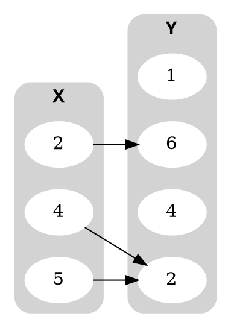
Yes, all elements in x have one corresponding element in Y.
#### e.
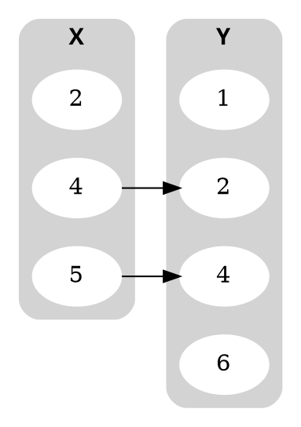
No, not all of the elements in X are mapped to an element in Y.

## Problem 18
#### Let ${h}$ be the constant function defined in example ${1.3.6}$. Find ${h(-\frac{12}{5}), h(\frac{0}{1})}$ and ${h(\frac{9}{17})}$.
- #### In ${1.3.6}$ the constant function is defined as ${h(r) = 2}$.
${h:r \rightarrow 2 \therefore h(\frac{-12}{5})=h(\frac{0}{1})=h(\frac{0}{1})=2}$.

## Problem 20
#### Define functions ${H}$ and ${K}$ from ${R}$ to ${R}$ by the following formulas: 
- #### For every ${x \in R, H(x) = (x-2)^2}$ and ${K(x) = (x-1)(x-3) + 1}$
#### Does ${H = K}$? Explain.
${H(x)=(x-2)^2\ \ \overrightarrow{algebraic}\ \ H(x)=x^2-4x+4}$
${K(x) = (x-1)(x-3) + 1\ \ \overrightarrow{FOIL}\ \ K(x)=x^2-3x-x+3+1\ \ \overrightarrow{simplify}\ \ K(x)=x^2-4x+4}$
H and K both simplify/expand out to be the same function, and since they have the same domain ${x \in \mathbb{R}}$ and co-domain ${(x-2)^2,H=K}$ as they are the same function.
                    
# Section 7.1
## Problem 2
#### Let ${X = \set{1,3,5}}$ and ${Y = {Y = \set{a,b,c,d}}}$. Define ${g:X\rightarrow Y}$ by the following arrow diagram:
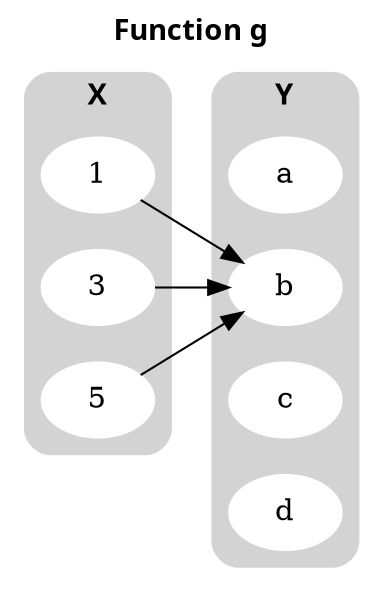
#### a.
Domain = ${\set{1,3,5}}$
Co-domain = ${\set{a,b,c,d}}$
#### b.
All elements in the domain map to the same element in the co-domain ${\therefore g(1)=g(3}=g(5)=b$.
#### c.
Their is only one mapped image and it is ${b \therefore}$ Range = ${\set{b}}$.
#### d.
3 is an inverse image of b, not a.
1 is an inverse image of b, as b is the image of 1.
#### e.
${\set{1,3,5}}$ is the inverse image of b.
c has no inverse as there is no preimage that corresponds to c. ${\set{0}}$
#### f.
${\set{(1,b),(3,b),(5,b)}}$

## Problem 4
#### b. Find all functions from ${X = \set{a,b,c}}$ to ${Y = \set{u}}$.
There is only one function ${f(X)=Y}$ because there is only one element in the co-domain.
This function can be defined as: ${x \in X, F(x) = u}$.

# Section 7.2
## Problem 7
#### Let ${X = \set{a,b,c,d}}$ and ${Y = \set{e,f,g}}$. Define function ${G}$ by the arrow diagram below.
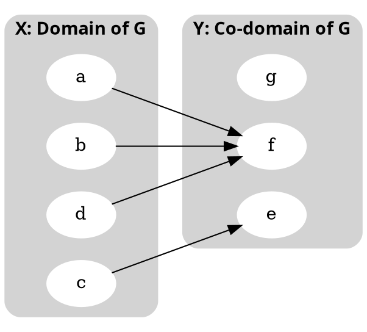
  
#### b. Is ${G}$ one-to-one? Why or why not? Is it onto? Why or why not?
${a}$ and ${b}$ have the same image and ${a \not= b}$, so it is not one-to-one. g does not have a pre-image, so the function is not onto either.

## Problem 8
#### Let ${X = \set{a,b,c}}$ and ${Y = \set{d,e,f,g}}$. Define function ${H}$ and ${K}$ by the arrow diagrams below.
#### a. Is ${H}$ one-to-one? Why or why not? Is it onto? Why or why not?
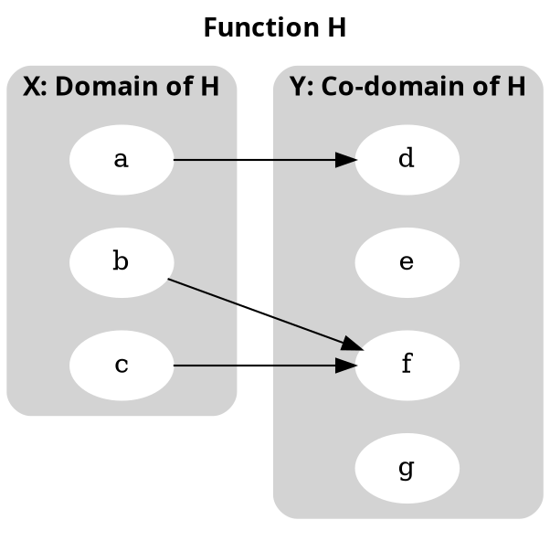
${b}$ and ${c}$ have the same image, but ${b \not= c}$, so ${H}$ is not one-to-one. ${g}$ does not have a pre-image, so the function is not onto.
         
#### b. Is ${K}$ one-to-one? Why or why not? Is it onto? Why or why not?
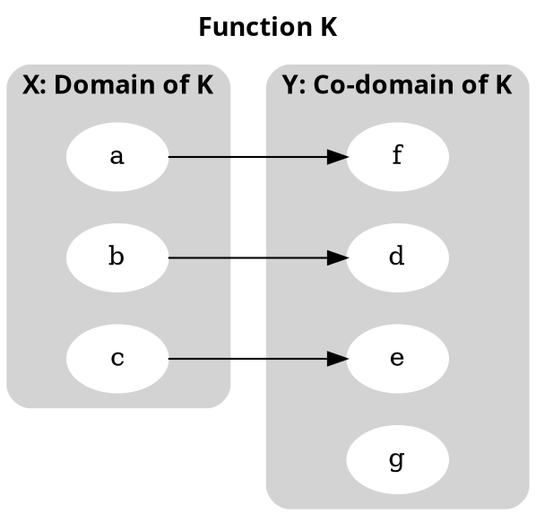
${a,b}$ and ${c}$ all have their own image, so ${K}$ is one-to-one. ${g}$ has no pre-image, so ${K}$ is not onto.