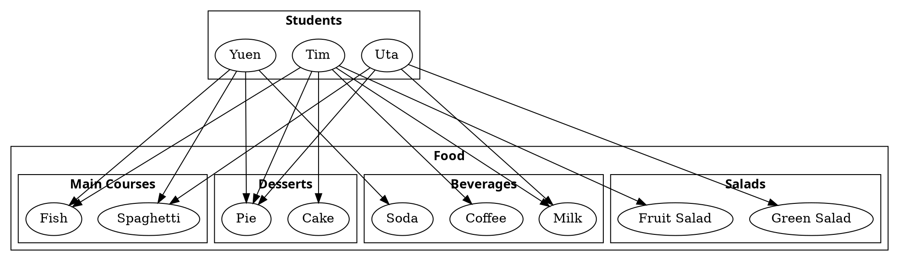
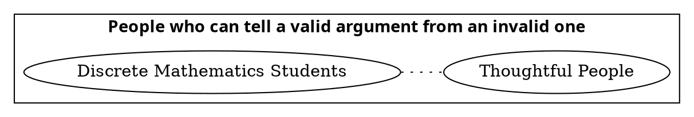
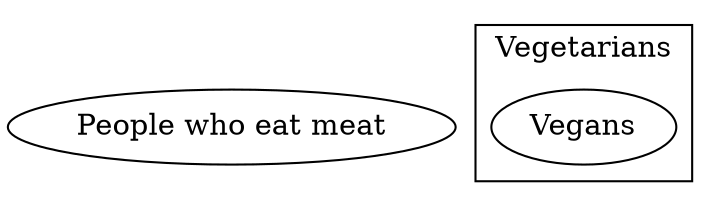

# **CSDS302 HW3 - Trevor Swan (*tcs94*)**
# 3.1

Note: For Section 3.1, problems 4ab and 7cd. These problems are different between the 4th edition and the 5th edition. This time, please use the problems from the 4th edition. I also take a picture of these three problems in the 4th edition. So if you do not have the 4th edition, you can use this photo. But our lecture will still use the content of the 5th edition.

## 4

Let $Q(n)$ be the predicate “$n^2 \le 30$."

### a

Write $Q(2)$, $Q(-2)$, $Q(7)$, and $Q(-7)$, and indicate which of these statements are true and which are false.
```ad-answer
$$
\begin{align}
Q(2) \text{ is } 2^2\le 30& && \text{This is true as }4\le 30 \\
Q(-2) \text{ is } (-2)^2\le 30& && \text{This is true as }4\le 30 \\
Q(7) \text{ is } 7^2\le 30& && \text{This is false as }49\not\le 30 \\
Q(-7) \text{ is } (-7)^2\le 30& && \text{This is false as }49\not\le 30 \\
\end{align}
$$
```

### b

Find the truth set of $Q(n)$ if the domain of $n$ is $\mathbf Z$, the set of all integers.
```ad-answer
$$
\begin{align}
n\in \mathbb{Z}\text{ but } n^2\le 30 \therefore \text{Truth Set=}&-5\le n\le5 \\
\text{Truth Set=}& \set{-5,-4,-3,-2,-1,0,1,2,3,4,5}
\end{align}
$$
```

## 7

Find the truth set of each predicate.

### c

Predicate: $1 \le x^2 \le 4$, domain: $\mathbf R$
```ad-answer
Truth Set = $\pm[1,2] \therefore$ Truth Set = $x\in [-2,-1]\cup [1,2]$ 
```

### d

Predicate: $1 \le x^2 \le 4$, domain: $\mathbf Z$
```ad-answer
Truth Set = $\pm[1,2]\therefore$ Truth Set = $x\in\set{-2,-1,1,2}$
```

## 12

Find counterexamples to show that the statement is false

$\forall$ real numbers $x$ and $y$, $\sqrt{x+y}=\sqrt x+\sqrt y$.
```ad-answer
$$
\begin{align}
\text{Let... } &x=25 \text{ and } y=9 \\
\therefore &\sqrt{x+y} = \sqrt{25+9} = \sqrt{34} \\
\text{But } &\sqrt{x}=\sqrt{25}=5 \text{ and }\sqrt{y} = \sqrt{9} = 3 \\
\therefore &\sqrt{x}+\sqrt{y} = 5+3 = 8 \\
8\not=&\sqrt{34} \\
\end{align}
$$
```

## 17

Rewrite the following in the form “$\exists$ \_\_\_\_ $x$ such that \_\_\_\_.”

### b

Some real numbers are rational.
```ad-answer
$$
\exists x\in \mathbb{R} \text{ such that } x\in\mathbb{Q}
$$
In english, there exists $\exists$ a real number x such that x is rational 
```

## 20

Rewrite the following statement informally in at least two different ways without using variables or the symbol $\forall$ or the words “for all.”

$\forall$ real numbers $x$, if $x$ is positive then the square root of $x$ is positive.
```ad-answer
1. All positve real numbers have positive square roots. 
2. If there is a positve real number, then that numbers square root must always be positve.
```

## 22

Rewrite the following in the form “$\forall$ \_\_\_\_ $x$, if \_\_\_\_ then \_\_\_\_.”

### a

All Java programs have at least 5 lines.
```ad-answer
$\forall$ programs x, if x is written in java, then x has at least 5 lines of code.
```

## 28

Rewrite each statement without using quantifiers or variables. Indicate which are true and which are false, and justify your answers as best as you can.

Let the domain of $x$ be the set $D$ of objects discussed in mathematics courses, and let $\text{Real}(x)$ be “$x$ is a real number,” $\text{Pos}(x)$ be “$x$ is a positive real number,” $\text{Neg}(x)$ be “$x$ is a negative real number,” and $\text{Int}(x)$ be “$x$ is an integer.”

### a

$\text{Pos}(0)$
```ad-answer
0 is a positve real number. 
**This is false as 0 is not positive or negative, it is simply 0.**
```

### b

$\forall x,\text{Real}(x)\land \text{Neg}(x)\to \text{Pos}(-x)$
```ad-answer
If a numeber is both real and negative, then the negation of that number is positive
**This is true as the opposite of any negative number is positive of the same magnitude.**
```

### c

$\forall x,\text{Int}(x)\to\text{Real}(x)$
```ad-answer
If a number is any number that is an integer, then that number is also a real number.
**This is true as the set of real numbers contains all integers as well**
```

### d

$\exists x \text{ such that Real}(x)\land\lnot\text{Int}(x)$
```ad-answer
There exists some real number such that it is both real and not an integer.
**This is true, as all fractions are real but not integers**
```

# 3.2

## 1

Which of the following is a negation for “All discrete mathematics students are athletic”? More than one answer may be correct.

1. There is a discrete mathematics student who is nonathletic.
2. All discrete mathematics students are nonathletic.
3. There is an athletic person who is not a discrete mathematics student.
4. No discrete mathematics students are athletic.
5. Some discrete mathematics students are nonathletic.
6. No athletic people are discrete mathematics students.
```ad-answer
Let $D=$"Discrete Math Students" and $p(x)=$"the student is athletic"
$\lnot(\forall x\in D,p(x))\equiv\exists x\in D, \lnot p(x)$
Answers 1 and 5 are negations of the predicate as the form must be "There exists a discrete math student that is not athletic". All other choices are not negations.
```

## 5

Write a negation for each of the following statements.

### a

Every valid argument has a true conclusion.
```ad-answer
There exists a Valid Argument that does not have a true conclusion.
```

### b

All real numbers are positive, negative, or zero.
```ad-answer
There exists a Real Number that is not positive, negative, or zero.
```

## 12

Determine whether the proposed negation is correct. If it is not, write a correct negation.

*Statement*: The product of any irrational number and any rational number is irrational.

*Proposed negation*: The product of any irrational number and any rational number is rational.
```ad-answer
This negation of a universal qualifier is not correct, it must be in the form:
$\exists x\in D, \lnot p(x)$
**The domain must stay the same**
The correct negation for this statement would be There is a product of an irrational number with a rational number where the result is not irrational. 
```

## 17

Write a negation for each statement

$\forall$ integers $d$, if $\frac{6}{d}$ is an integer, then $d=3$
```ad-answer
$\exists$ integers d, such that $\frac{6}{d}$ is an integer and $d\not=3$.
```

## 29

Write the contrapositive, converse, and inverse. Indicate as best as you can which of these statements are true and which are false. Give a counterexample for each that is false.

$\forall n\in Z$, if $n$ is prime then $n$ is odd or $n=2$.
```ad-answer
Contrapositive: $\forall n\in\mathbb{Z}, \text{ if n is not odd or } n\not=2\text{ then n is not prime}$. This is **true**.

Converse: $\forall n\in \mathbb{Z}, \text{if n is odd or }n=2\text{ then n is prime}$. This is **false**.

Inverse: $\forall x\in D, \text{ if n is not prime then n is not odd or }n\not=2$. This is **false**.
```

## 48

Use the facts that the negation of a $\forall$ statement is a $\exists$ statement and that the negation of an if-then statement is an and statement to rewrite the statement without using the word necessary or sufficient.

Being a polynomial is not a sufficient condition for a function to have a real root.
```ad-answer
$P(x)\text{ is not a sufficient condition of }Q(x)$. Where:
- $P(x)=$ a function f is a polynomial
- $Q(x)=$ a function f has a real root
$\equiv\lnot(\forall f,)$ if $P(f)$ then $Q(f)$.
$\equiv\exists f$ such that $P(x)$ and $\lnot Q(x)$.
$\therefore$ **There exists a polynomial function such that the function does not have a real root.**
```

# 3.3

## 2

Let $G(x, y)$ be “$x^2>y$” Indicate which of the following statements are true and which are false.

### a

$G(2,3)$
```ad-answer
$G(2,3) = 2^2 > 3 = 4>3$. This is true $\checkmark$
```

### b

$G(1,1)$
```ad-answer
$G(1,1) = 1^1 > 1 = 1> 1$. This is false $X$
```

### c

$G\left( \frac{1}{2}, \frac{1}{2} \right)$
```ad-answer
$G(\frac{1}{2},\frac{1}{2})=(\frac{1}{2})^2 > \frac{1}{2} = \frac{1}{4}>\frac{1}{2}$. This is flase $X$
```

### d

$G(-2,2)$
```ad-answer
$G(-2,2)=(-2)^2>2=4>2$. This is true $\checkmark$
```

## 10

Determine whether each of the following statements is true or false.



### a

$\forall$ student $S$, $\exists$ a dessert $D$ such that $S$ chose $D$.
```ad-answer
This is true as each student picked at least one dessert.
```

### b

$\forall$ student $S$, $\exists$ a salad $T$ such that $S$ chose $T$.
```ad-answer
This is false because not every student chose a salad. In this case, Yuen did not chose a salad.
```

## 19

Rewrite the statement in English without using the symbol $\forall$ or $\exists$ or variables and expressing your answer as simply as possible. Also, write a negation for the statement.

$\exists x\in\mathbf R$ such that for every real number $y$,
$x+y=0$
```ad-answer
The exists a real number x such that its sum with any real number y is 0.

Negation: For every real number x, there exists a real number y whose sum is not 0.
```

## 23

Rewrite the statement in English without using the symbol $\forall$ or $\exists$ or variables. Also, indicate whether the statement is true or false.

### a

$\forall$ nonzero real number $r$, $\exists$ a real number $s$ such that $rs=1$.
```ad-answer
For all nonzero real numbers, there exists a real number such that their product is 1. This is **True** $\checkmark$
```

### b

$\exists$ a real number $r$ such that $\forall$ nonzero real number $s$, $rs=1$.
```ad-answer
There exists a real number such that for any multiplication with a nonzero real number, its product is 1. The statement does not require them to be inverses, so this is false $X$
```

# 3.4

## 2

Use universal instantiation or universal modus ponens to
fill in valid conclusions for the argument

If an integer $n$ equals $2k$ and $k$ is an integer, then $n$ is even.
$0$ equals $2\times0$ and $0$ is an integer.
```ad-answer
$\therefore$ 0 is even.
```

## 14

The argument may be valid by universal modus ponens or universal modus tollens; others are invalid and exhibit the converse or the inverse error. State whether the argument is valid or invalid. Justify your answer.

If compilation of a computer program produces error messages, then the program is not correct.
Compilation of this program does not produce error messages.
$\therefore$ This program is correct.
```ad-answer
This is invald through the inverse error as you cannot assume $\lnot Q(x)$ for a particular x where $\lnot P(x)$
```

## 22-24

Indicate whether the arguments in 22–24 are valid or
invalid. Support your answers by drawing diagrams.

### 22

All discrete mathematics students can tell a valid argument from an invalid one.
All thoughtful people can tell a valid argument from an invalid one.
$\therefore$ All discrete mathematics students are thoughtful.
````ad-answer

As indicated by the dotted line between these two nodes, there is a possible overlap between them, but it is **not** guaranteed. Because of this, This argument is invalid.
````

### 24

No vegetarians eat meat.
All vegans are vegetarian.
$\therefore$ No vegans eat meat.
````ad-answer

This is a valid argument as seen in the diagram where the vagan node is not inside of the meat eater node, but instead it is inside of the vegetarian node, which is established to not eat meat.
````


#### Thank you to Trevor Nichols for copying textbook questions into a markdown format 