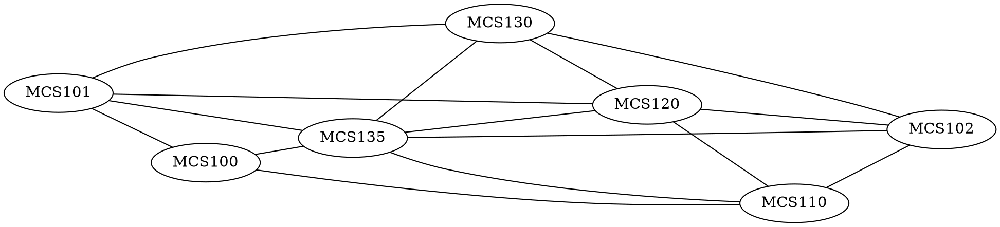

# **CSDS302 HW8 - Trevor Swan (*tcs94*)**
# 9.4

## 4

In a group of $700$ people, must there be $2$ who have the same first and last initials? Why?
> [!answer]
> Yes, there are 26 letters in the English alphabet, so there are $26\cdot26=676$ possible combinations of first and last initials. By the pigeonhole principle, in a group of 700 people, there must be at least two people who share the same first and last initials. This holds true for groups of 700 abiding by the English alphabet, though larger alphabets would yield different conclusions.

## 7

Let $S=\{3, 4, 5, 6, 7, 8, 9, 10, 11, 12\}$. Suppose six integers are chosen from $S$. Must there be two integers whose sum is $15$? Why?
> [!answer]
> First we can divide the set into its pairs of numbers that sum to 15:
> $$ (3,12),(4,11),(5,10),(6,9),(7,8) $$
> We can see that, through the pigeonhole principle, if we chose 6 random integers from $S$, then at least two will be from a pair above, showing that at least two of the random 6 integers will sum to 15.

## 11

If $n+1$ integers are chosen from the set $\{1, 2, 3,..., 2n\}$, where $n$ is a positive integer, must at least one of them be even? Why?
> [!answer]
> In the set $\set{1,2,3,\dots,2n}$, there are $n$ even integers and $n$ odd integers, given by:
>  $$
> \begin{align}
> \text{Evens:}&\quad\set{2,4,6,\dots,2n} \\
> \text{Odds:}&\quad\set{1,3,5,\dots,2(n-1)+1}
> \end{align}
> $$
> Because there are only $n$ of each type of integer (even/odd), then randomly selecting $n+1$ integers from the set guarantees at least one even integer by the pigeonhole principle.  

## 31

A group of $15$ executives are to share $5$ assistants. Each executive is assigned exactly $1$ assistant, and no assistant is assigned to more than $4$ executives. Show that at least $3$ assistants are assigned to $3$ or more executives.
> [!answer]
> I will use the generalized pigeonhole principle (GPP) to prove this. This says $m$ pigeons $\to\ n$ holes and $m>n$, then at least one hole will have at least $k+1$ pigeons.
> ****
> Let there be $k$ number of assistants assigned to 3 or more executives, with $A$ being the set of these executives. Because each assistant is assigned to more than 4 executives, there are at most $4k$ executives in $A$ by the contrapositive of the GPP. The assistants with at most 2 executives is given by $5-k$, so there are $2(5-k)=10-2k$ executives given by the contrapositive form of the GPP.
> ****
> The maximum number of executives can therefore be given as $4k+(10-2k)=2k+10$, and with 15 assistants we can say:
> $$
> \begin{align}
> 2k+10\ge & 15 \\
> k\ge & 2.5
> \end{align}
> $$
> $k$ must be an integer, so we round up to say $k\ge3$. We defined $k$ as the number of assistants that are assigned to 3 or more executives, so we can conclude that there are at least 3 assistants assigned to 3 or more executives.
> $\square$

## 33

Let $A$ be a set of six positive integers each of which is less than $15$. Show that there must be two distinct subsets of $A$ whose elements when added up give the same sum. (Thanks to Jonathan Goldstine for this problem.)
> [!answer]
> First we can observe the minimum and maximum bounds for the subsets of $A$ as:
> $$
> \begin{align}
> \text{Min:}&\quad\set{1,2,3,4,5,6}\to21 \\
> \text{Max:}&\quad\set{9,10,11,12,13,14}\to69
> \end{align}
> $$
> We can then define $B$ to be the set of all the possible subsets of $A$, and $C$ to be the set of all integers $[21,69]$, to represent the possible sums of the subsets. We can note that $B$ has $2^6=64$ possible subsets, by the definition of a subset. We can also see that $C$ contains $69-21+1=49$ integers. By the GPP, there are more possible possible subsets of $A$ than there are sums of these subsets, so we can conclude that there must be two distinct subsets of $A$ whose sums are equivalent.

# 9.5

## 7

A computer programming team has 13 members.

### a

How many ways can a group of seven be chosen to work on a project?
> [!answer]
> Here we can say $n=13$ and $r=7$, for the 13 possible elements (members) and 7 arrangements (group size). Here, the permutation of the members is arbitrary, so:
> $$ C(13,7)= \frac{13!}{7!(13-7)!}=1716 $$
> So there are $\boxed{1716}$ ways to arrange 13 members into groups of 7 for the project.

### b

Suppose seven team members are women and six are men.

#### i

How many groups of seven can be chosen that contain four women and three men?
> [!answer]
> First we must choose 4 of the 7 women and 3 of the 6 men:
> $$
> \begin{align}
> \text{Women:}&\quad{7\choose4}=\frac{7!}{4!(7-4)!}=35 \\
> \text{Men:}&\quad{6\choose3}=\frac{6!}{3!(6-3)!}=20
> \end{align}
> $$
> We can then use the multiplication rule to say:
> $$ \text{Total Ways}={7\choose4}\cdot{6\choose3} $$
> Substituting the above calculations in we get that there are $35\cdot20=700$ total ways to arrange the population into the groups requested.

#### ii

How many groups of seven can be chosen that contain at least one man?
> [!answer]
> From part $(a)$, we know that there are 1716 different ways to arrange the members into a group of 7. Since there are 7 women in this sample, then there is exactly one group which contains only women. This means that there are $1716-1=\boxed{1715}$ ways to select a committee with at least one man.

#### iii

How many groups of seven can be chosen that contain at most three women?
> [!answer]
> To solve this problem we must use the multiplication rule, addition rule, and the definition of a combination. We know that there are 7 women and 6 men in the group. We must sum the number of ways to select 3 women, number of ways to select 2, and the number of ways to select 1. The calculation is as follows
> #### Number of ways to select 3 women
> $$
> \begin{align}
> {6\choose4}\cdot{7\choose3}=&\frac{6!}{4!(6-4)!}\cdot \frac{7!}{3!(7-3)!} \\
> =&525
> \end{align}
> $$
> #### Number of ways to select 2 women
> $$
> \begin{align}
> {6\choose5}\cdot{7\choose2}=&\frac{6!}{5!(6-5)!}\cdot \frac{7!}{2!(7-2)!} \\
> =&126
> \end{align}
> $$
> #### Number of ways to select 1 woman
> $$
> \begin{align}
> {6\choose6}\cdot{7\choose1}=&\frac{6!}{6!(6-6)!}\cdot \frac{7!}{1!(7-1)!} \\
> =&7
> \end{align}
> $$
> *Note that we cannot select no women, since we need a group of 7 and there are only 6 men.* 
> ****
> The sum of the above calculations gives our result to be:
> $$ 525+126+7=\boxed{658\text{ Possible ways}} $$


### c

Suppose two team members refuse to work together on projects. How many groups of seven can be chosen to work on a project?
> [!answer]
> Let us define two members $A$ and $B$ who refuse to work together. First, we must calculate the number of groups with $A$, but not $B$ as:
> $$ {11\choose 6}= \frac{11!}{6!(11-6)!}=462 $$
> This works because we know $A$ is in the group, so $B$ is definitely not in the group, and we need to assign the remaining 6 group members.
> We can then do the same but reversed, assuming $B$ is in the group by default. The calculation ends up being the same:
>  $$ {11\choose 6}= \frac{11!}{6!(11-6)!}=462 $$
>  We must now calcualte the number of groups with neither $A$ nor $B$ in the group, so we have to select 7 members from the remaining pool of 11 candidates as:
>  $$ {11\choose 7}= \frac{11!}{7!(11-7)!}=330 $$
>  ****
>  Using the addition rule, we can determine the total number of groups by adding the above calculations as:
>  $$ 462+462+330=\boxed{1254\text{ Possible Ways}} $$ 

### d

Suppose two team members insist on either working together or not at all on projects. How many groups of seven can be chosen to work on a project?
> [!answer]
>  Let us define two members $A$ and $B$ who refuse to work together. We must first calculate the number of ways both $A$ and $B$ can be in a group together as:
>  $$ {11\choose 5}= \frac{11!}{5!(11-5)!}=462 $$
>  This works because we know both $A$ and $B$ are in the same group, so we must select the remaining 5 members.
>  We must now calculate the number of groups with neither $A$ nor $B$ in the group, so we have to select 7 members from the remaining pool of 11 candidates as:
>  $$ {11\choose 7}= \frac{11!}{7!(11-7)!}=330 $$
>  ****
>  Using the addition rule, we can determine the total number of groups by adding the above calculations as:
>  $$ 462+330=\boxed{792\text{ Possible Ways}} $$ 

## 8

An instructor gives an exam with fourteen questions. Students are allowed to choose any ten to answer.

### a

How many different choices of ten questions are there?
> [!answer]
> Here we can say $n=14$ and $r=10$, for the 14 possible elements (questions) and 10 arrangements (choices). Here, the permutation of the members is arbitrary, so:
> $$ C(14,10)= \frac{14!}{10!(14-10)!}=1001 $$
> So there are $\boxed{1001}$ ways to arrange 14 questions into 10 chosen ones.

### b

Suppose six questions require proof and eight do not.

#### i

How many groups of ten questions contain four that require proof and six that do not?
> [!answer]
> We must determine this using the multiplication rule, where the number of ways to arrange 6 non-proof questions and 4 proof questions can be multiplied together to yield the total number of arrangements as follows:
> $$ {6\choose4}\cdot{8\choose6}= \frac{6!}{4!(6-4)!}\cdot \frac{8!}{6!(8-6)!}=15\cdot28=420 $$
> Therefore there are $\boxed{420\text{ Possible Ways}}$.

#### ii

How many groups of ten questions contain at least one that requires proof?
> [!answer]
> Since there are 8 non-proof questions and only 6 proof questions, any combination of 10 questions will always have to contain a proof question by the GPP. Therefore, the answer here is the same as that in part $(a)$, so there are $\boxed{1001\text{ Possible Ways}}$.

#### iii

How many groups of ten questions contain at most three that require proof?
> [!answer]
> To solve this problem we must use the multiplication rule, addition rule, and the definition of a combination. We know that there are 7 women and 6 men in the group. We must sum the number of ways to select 3 women, number of ways to select 2, and the number of ways to select 1. The calculation is as follows
> #### Number of ways to select 3 proofs
> $$
> \begin{align}
> {6\choose3}\cdot{8\choose7}=&\frac{6!}{3!(6-3)!}\cdot \frac{8!}{7!(8-7)!} \\
> =&160
> \end{align}
> $$
> #### Number of wats to select 2 proofs
> $$
> \begin{align}
> {6\choose2}\cdot{8\choose8}=&\frac{6!}{2!(6-2)!}\cdot \frac{8!}{8!(8-8)!} \\
> =&15
> \end{align}
> $$
> *Note that there is at least 2 proof questions in a random selection of 10 questions as there are only 8 non-proof questions to reach 10 total.
> *****
> Using the addition rule, we can determine the total number of groups by adding the above calculations as:
>  $$ 160+15=\boxed{175\text{ Possible Ways}} $$ 

### c

Suppose the exam instructions specify that at most one of questions $1$ and $2$ may be included among the ten. How many different choices of ten questions are there?
> [!answer]
> To answer this question, we must sum the number of ways question 1 is selected, the number of ways question 2 is selected, and the number of ways where neither question 1 nor question 2 are selected.
> #### Number of  ways to select question 1 but not 2
> $$ {12\choose9}= \frac{12!}{9!(12-9)!}=220 $$
> #### Number of ways to selection question 2 but not 1
> $$ {12\choose9}= \frac{12!}{9!(12-9)!}=220 $$
> #### Number of ways to select neither 1 nor 2
> $$ {12\choose10}= \frac{12!}{10!(12-10)!}=66 $$
> ****
> The sum of the calculations above yields our answer of:
> $$ 220+220+66=\boxed{506\text{ Possible Ways}} $$

### d

Suppose the exam instructions specify that either both questions $1$ and $2$ are to be included among the ten or neither is to be included. How many different choices of ten questions are there?
> [!answer]
> To answer this question, we must sum the number of ways where both 1 and 2 are selected with the number of ways where neither 1 nor 2 are selected.
> #### Number of ways to select both question 1 and 2
> $$ {12\choose8}= \frac{12!}{8!(12-8)!}=495 $$
> #### Number of ways to select neither 1 nor 2
> $$ {12\choose10}= \frac{12!}{10!(12-10)!}=66 $$
> ****
> The sum of the calcualtions above yields the answer of:
> $$ 495+66=\boxed{561\text{ Possible Ways}} $$

## 10

Two new drugs are to be tested using a group of $60$ laboratory mice, each tagged with a number for identification purposes. Drug $A$ is to be given to $22$ mice, drug $B$ is to be given to another $22$ mice, and the remaining $16$ mice are to be used as controls. How many ways can the assignment of treatments to mice be made? (A single assignment involves specifying the treatment for each mouse—whether drug $A$, drug $B$, or no drug.)
> [!answer]
> First we will assign Drug A to 22 of the 60 lab mice as:
> $$ {60\choose22}= \frac{60!}{22!(60-22)!}= \frac{60!}{22!38!} $$
> Now there are 38 remaining mice, and we will now assign 22 of them Drug B:
>  $$ {38\choose22}= \frac{38!}{22!(38-22)!}= \frac{38!}{22!16!} $$
>  Now there are 16 remaining mice, and we will now assign them the control:
>  $$ {16\choose16}= \frac{16!}{16!(16-16)!}=1 $$
>  ****
>  To determine the number of ways we can assign the mice to the different groups, we must now multiply the results above as:
>  $$ \frac{60!}{22!38!}\cdot\frac{38!}{22!16!}\cdot1=\boxed{\frac{60!}{22!22!16!}} $$
>  We can 'simplify' this result to be: $\boxed{~3.15\times10^{26}}$

## 13

A coin is tossed ten times. In each case the outcome $H$ (for heads) or $T$ (for tails) is recorded. (One possible outcome of the ten tosses is denoted $T~H~H~T~T~T~H~T~T~H$.)

### b

In how many of the possible outcomes are exactly five heads obtained?
> [!answer]
> We do not care about the order in which the heads are flipped, so we want to select 5 of the 10 tosses as:
> $$ {10\choose5}= \frac{10!}{5!(10-5)!}=\boxed{252\text{ Possible Ways}} $$

### e

In how many of the possible outcomes is at most one head obtained?
> [!answer]
> To answer this we must sum the number of ways 0 heads can be flipped with the number of ways 1 head can be flipped. Individually, we calculate as:
> #### Number of ways to flip 0 heads
> $$ {10\choose0}= \frac{10!}{0!(10-0)!}=1 $$
> #### Number of ways to flip 1 head  
> $$ {10\choose1}= \frac{10!}{1!(10-1)!}=10 $$
> *Note that the ${n\choose0}={n\choose n}$ and ${n\choose1}={n\choose (n-1)}$, so order of the combination doesn't matter.*
> ****
>  The sum of the above calculations reveals the answer to be:
>  $$ 1+10=\boxed{11\text{ Possible Ways}} $$

## 16

Suppose that three microchips in a production run of forty are defective. A sample of five is to be selected to be checked for defects.

### b

How many samples will contain at least one defective chip?
> [!answer]
>  The total number of 5-chip samples can be given as:
>  $$ {40\choose5}= \frac{40!}{5!(40-5)!}=658,008 $$
>  The total number of 5-chip samples if we are guaranteed to not pull a defective chip is:
>  $$ {37\choose5}= \frac{37!}{5!(37-5)!}=435,897 $$
>  ****
>  Therefore the total number of samples that will contain at least one defective chip is given as the difference of the calculations above:
>  $$ 658,008-435,897=\boxed{222,111\text{ Samples}} $$

### c

What is the probability that a randomly chosen sample of five contains at least one defective chip?
> [!answer]
> From part $(b)$, we know that $222,111$ samples contain a defective chip, and that there are $658,008$ possible samples. Therefore the probability of a sample having a defective chip can easily be calculated as:
> $$ \frac{222,111}{658,008}\approx\boxed{0.3376=33.76\%} $$

## 20

### a

How many distinguishable ways can the letters of the word $MILLIMICRON$ be arranged in order?
> [!answer]
> We must use the definition of permutations of sets of indistinguishable objects, starting by analyzing the number of distinct letters.
> ****
> With a total number of $n=11$ positions to choose from, there are **2 M's, 3 I's, 2 L's, 1 C, 1 R, 1 O, and 1 N**. Using this and the definition mentioned earlier, we can calculate the following:
> $$ \frac{n!}{n_M!n_I!n_L!n_C!n_R!n_O!n_N!}=\frac{11!}{2!3!2!1!1!1!1!}=\boxed{1,663,200\text{ Ways}} $$ 

### b

How many distinguishable orderings of the letters of $MILLIMICRON$ begin with $M$ and end with $N$?
> [!answer]
> We must use the definition of permutations of sets of indistinguishable objects, starting by analyzing the number of distinct letters.
> ****
> With a total number of $n=9$ positions (starting and ending pre-determined), there are **1 M, 3 I's, 2 L's, 1 C, 1 R, and 1 O**. Using this and the definition mentioned earlier, we can calculate the following:
> $$ \frac{n!}{n_M!n_I!n_L!n_C!n_R!n_O!}=\frac{9!}{1!3!2!1!1!1!}=\boxed{30,240\text{ Ways}} $$ 

### c

How many distinguishable orderings of the letters of $MILLIMICRON$ contain the letters $CR$ next to each other in order and also the letters $ON$ next to each other in order?
> [!answer]
> We must use the definition of permutations of sets of indistinguishable objects, starting by analyzing the number of distinct letters.
> ****
> With a total number of $n=9$ positions (neighboring pairs determined), there are **2 M's, 3 I's, 2 L's, 1 CR, and 1 ON**. Using this and the definition mentioned earlier, we can calculate the following:
> $$ \frac{n!}{n_M!n_I!n_L!n_{CR}!n_{ON}!}=\frac{9!}{2!3!2!1!1!}=\boxed{15,120\text{ Ways}} $$ 

# 9.8

## 3

Suppose $A$ and $B$ are mutually exclusive events in a sample space $S$, $C$ is another event in $S$, $A\cup B\cup C=S$, and $A$ and $B$ have probabilities $0.4$ and $0.2$, respectively.

### a

What is $P(A\cup B)?$
> [!answer]
> $A$ and $B$ are mutually exclusive events, so we can say (by the probability axiom):
>  $$ P(A\cup B)=P(A)+P(B)=0.4+0.2=\boxed{0.6} $$

### b

Is it possible that $P(C)=0.2$? Explain.
> [!answer]
> Based on the given that $A\cup B\cup C=S$, we can say that $(A\cup B)^C\subseteq C$. This means that $C$ contains the complement of $A\cup B$, leading us to draw the following conclusion:
> $$ P(C)=1-P(A\cup B)=1-0.6=0.4 $$
> Therefore we can say that $\boxed{P(C)\neq0.2}$

## 15

A company offers a raffle whose grand prize is a $40,000 new car. Additional prizes are a $1,000 television and a $500 computer. Tickets cost $20 each. Ticket income over the cost of the prizes will be donated to charity. If 3,000 tickets are sold, what is the expected gain or loss of each ticket?
> [!answer]
> There are only three winners for the raffle, so that leaves 2997 people losing the money they put in. The grand prize winner  will win $\$40,000-\$20=\$39,980$, the second place winner will win $\$1,000-\$20=\$980$, the third place winner will win $\$500-\$20=\$480$. The rest of the participants lose $\$20$. We can calculate expected value as follows:
> $$ \mathbb{E}=\$39980\cdot\frac{1}{3000}+\$980\cdot\frac{1}{3000}+\$480\cdot\frac{1}{3000}-\$20\cdot\frac{2997}{3000}$$
> This lengthy expression simplifies down to $\boxed{\mathbb{E}=\$-6.17}$ for an expected gain or loss, which is logical because of how few people will spend money but not win.

## 18

An urn contains five balls numbered $1, 2, 2, 8,  8$. If a person selects a set of three balls at random, what is the expected value of the sum of the numbers on the balls?
> [!answer]
> The pool of possible sums for the balls in the urn can be expressed as a set:
> $$ \set{5, 11, 11, 11, 11, 12, 12, 17, 18, 18} $$
> This is determined by combining the all the possible combinations of the numbers and recording their sum proactively.
> ****
> We can use the above information to calculate the expected value of the sum to be:
> $$ \mathbb{E}=5\cdot \frac{1}{10}+ 11\cdot \frac{4}{10}+12\cdot \frac{2}{10}+17\cdot \frac{1}{10}+18\cdot \frac{2}{10}$$
> This expression is derived from multiplying the possible value by its number of occurances out of the 10 possible sums. This expression simplifies to an expected sum of $\boxed{\mathbb{E}=12.6}$.

# 9.9

## 2

Suppose $P(X|Y)=\frac{1}{3}$ and $P(Y)=\frac{1}{4}$. What is $P(X\cap Y)$?
> [!answer]
> $P(X|Y)=\frac{P(X\cap Y)}{P(Y)}$ so we can say:
> $$ \frac{1}{3}= \frac{P(X\cap Y)}{\frac{1}{4}}\therefore \boxed{P(X\cap Y)=\frac{1}{12}} $$

## 18

Prove that if:
- $P(A\cap B)=P(A)\cdot P(B)$
- $P(A)\ne0$
- $P(B)\ne0$
Then:
- $P(A|B)=P(A)$
- $P(B|A)=P(B)$
> [!answer]
> Based on the given above, we first prove that $P(A|B)=P(A)$
> $$
> \begin{align}
> P(A|B)=&\frac{P(B\cap A)}{P(B)} && \text{Definition} \\
> =& \frac{P(A\cap B)}{P(B)} && \text{Communicative} \\
> =& \frac{P(A)\cdot P(B)}{P(B)} && \text{Substitute Given} \\
> =& P(A) && \text{Simplify}
> \end{align}
> $$ 
> Now we must use the given to prove that $P(B|A)=P(B)$ for this specific scenario
> $$
> \begin{align}
> P(B|A)=&\frac{P(A\cap B)}{P(A)} && \text{Definition} \\
> =& \frac{P(A)\cdot P(B)}{P(A)} && \text{Substitute Given} \\
> =& P(B) && \text{Simplify}
> \end{align}
> $$ 
> Both of the above show lead to the desired conclusion, so we have proved that if $P(A\cap B)=P(A)\cdot P(B), P(A)\neq0, P(B)\neq0$, then both $P(A|B)=P(A)$ and $P(B|A)=P(B)$ are true.
> $\square$

# Additional

## 1

**(8 points)** One blue die and one gray die are rolled, what is the probability that the sum of the numbers is 6, given that both of the numbers are odd?
> [!answer]
> 1. First we can define a sample space $S$ for this scenario as $S=\set{1\ 1, 1\ 2, 1\ 3, 1\ 4\dots, 6\ 6}$, representing the possible combinations of the dice. Since the dice are distinguishable, we know that there are 36 total combinations for the die given by $6^2$, meaning that $|S|=36$.
> 2. Then we can determine the number of rolls where both die are odd, given by $\set{1\ 1, 1\ 3, 1\ 5\dots, 5\ 5}$. We can observe that a total of 9 possible rolls contain die with both odd numbers being rolled.
> 3. Next we define the possible combinations of rolls that sum to 6 in the general sample space as $S'=\set{1\ 5, 5\ 1, 2\ 4, 4\ 2, 3\ 3}$. We can observe that there are 5 of these combinations, so $|S'|=5$.
> ****
> Now we can use the definition of conditional probability, defining event $A$ as the roll is both odd, and $B$ as the roll sums to 6.
> $$ P(B|A)=\frac{P(A\cap B)}{P(A)}= \frac{\frac{|A\cap B|}{|S|}}{\frac{|A|}{|S|}}= \frac{\frac{3}{36}}{\frac{9}{36}}=\frac{3}{9}=\frac{1}{3}$$ 
> Therefore the probability that if one blue die and one gray die are rolled, the sum of the numbers is 6, given that both of the numbers are odd is $\boxed{\frac{1}{3}}$

## 2

**(8 points)** Imagine there is a drug test that is 98% accurate, meaning that 98% of the time, it shows a true positive result for someone using the drug, and 98% of the time, it shows a true negative result for nonusers of the drug. Next, assume 0.5% of people use the drug. If a person selected at random tests positive for the drug, what is the probability the person is actually a user of the drug?
> [!answer]
> First we can define the following:
> - $P(B|A)$: the probability of testing positive given that the person uses the drug. This is the accuracy of the test for true positives, which is 98% or 0.98.
> - $P(A)$: the probability that a person uses the drug, which is 0.5% or 0.005.
> - $P(B)$: is the total probability of testing positive, which is the sum of the probabilities of testing positive given drug use and testing positive given no drug use.
> ****
> It is given that the drug test is only accurate $98\%$ of the time, so that 98% of the time, it shows a true positive result for someone using the drug, and 98% of the time, it shows a true negative result for nonusers of the drug. We can decompose this situation into two cases, given that only $0.5\%$ of people use the drug:
> #### Case 1: True Positive for Drug Users
> $$ P_1 = 0.5\%\times98\%=0.0049 $$
> #### Case 2: True Positive for Non Drug Users
> $$ P_2 = 99.5\%\times2\%=0.0199 $$ 
> ****
> Summing these probabilities together yields the actual success rate of the drug, which is:
> $$ P(B)=P_1+P_2=0.0049+0.0199=0.0248 $$
> ****
> Finally, we can use Bayes Theorem which says:
> $$ P(A|B)= \frac{P(B|A)\cdot P(A)}{P(B)}$$
> We have solved for the quantities in the right sand of the expression above, so now was can solve for $P(A|B)$, which is the probability that a person who uses the drug correctly tests positive:
> $$ P(A|B) = \frac{0.98\cdot0.005}{0.0248}\approx\boxed{0.1976=19.76\%} $$

# 1.4

## 5

Show that the two drawings represent the same graph by labeling the vertices and edges of the right-hand drawing to correspond to those of the left-hand drawing.

![[5.svg|500]]
> [!answer]
> ![[1.4.5_sol]]

## 8

![[8.svg|500]]

### i

Find all edges that are incident on $v_1$.
> [!answer]
> Edges incident to $v_1$ are those that connect $v_1$ to some other vertex. These edges are:
> $$\text{Edges indident to }v_1=e_1,e_2,e_3$$

### ii

Find all vertices that are adjacent to $v_3$.
> [!answer]
> Vertices adjacent to $v_3$ are those that have an edge between $v_3$ and itself. These are: 
> $$ \text{Vertices adjacent to }v_3=v_1,v_2,v_3 $$
> *Note: $v_3$ is adjacent to itself here because there is a loop.*

### iii

Find all edges that are adjacent to $e_1$.
> [!answer]
> Edges that are adjacent to $e_1$ are those that connect to the same vertex as $e_1$. These are:
> $$ \text{Edges adjacent to }e_1=e_2,e_3,e_8,e_9 $$

### iv

Find all loops.
> [!answer]
> Loops are defined as edges that connect a vertex with itself. Here, these are:
> $$ \text{Loops}=e_6,e_7 $$

### v

Find all parallel edges.
> [!answer]
> Edges are parallel if they have the exact same endpoints on a graph. These are:
> $$ \text{Parallel edges}=\set{e_4,e_5},\set{e_8,e_9} $$

### vi

Find all isolated vertices.
> [!answer]
> A vertex is isolated if no edges are incident to it. These are:
> $$ \text{Isolated vertices}=v_6 $$

### vii

Find the degree of $v_3$.
> [!answer]
> The degree of a vertex is the number of edges that connect to it. For $v_3$:
> $$ \deg(v_3)=3+2(1)=5 $$
> *Note that loops are counted twice when determining vertex degree.*

## 14

Two jugs $A$ and $B$ have capacities of $3$ quarts and $5$ quarts, respectively. Can you use the jugs to measure out exactly $1$ quart of water, while obeying the following restrictions?

- You may fill either jug to capacity from a water tap
- You may empty the contents of either jug into a drain
- You may pour water from either jug into the other.
> [!answer]
> ```dot
> digraph {
> 	rankdir=LR
> 	"(0,0)"
> 	"(0,5)"
> 	"(3,5)"
> 	"(3,0)"
> 	"(3,2)"
> 	"(0,2)"
> 	"(2,0)"
> 	"(2,5)"
> 	"(3,4)"
> 	"(0,4)"
> 	"(3,1)"
> 	"(0,0)"->"(0,5)"
> 	"(0,5)"->"(0,0)"
> 	"(0,5)"->"(3,5)"
> 	"(2,5)"->"(0,5)"
> 	"(3,5)"->"(3,0)"
> 	"(3,0)"->"(0,0)"
> 	"(3,0)"->"(3,5)"
> 	"(0,0)"->"(3,0)"
> 	"(3,2)"->"(3,0)"
> 	"(0,5)"->"(3,2)"
> 	"(3,2)"->"(0,2)"
> 	"(0,2)"->"(2,0)"
> 	"(0,2)"->"(0,0)"
> 	"(2,0)"->"(0,0)"
> 	"(2,0)"->"(2,5)"
> 	"(2,5)"->"(3,4)"
> 	"(3,4)"->"(0,4)"
> 	"(0,4)"->"(0,0)"
> 	"(0,4)"->"(3,1)"
> }
> ```
> The digraph above shows a route to get to a bucket having 1 quart in it at the end of a certain walk. The ordered pairs in each vertices show the amount of water in each jug. Some edges may be omitted, but the true walk is fleshed out fully. This walk is:
> $$ (0,0)\to(0,5)\to(3,2)\to(0,2)\to(2,0)\to(2,5)\to(3,4)\to(0,4)\to(3,1) $$
> This walk follows the restrictions set in place while also ending with a bucket having exactly 1 quart at the very end.

## 17 

A department wants to schedule final exams so that no student has more than one exam on any given day. The vertices of the graph below show the courses that are being taken by more than one student, with an edge connecting two vertices if there is a student in both courses. Find a way to color the vertices of the graph with only four colors so that no two adjacent vertices have the same color and explain how to use the result to schedule the final exams.


> [!answer]
> I will use Red, Gray, Green, and Blue to color code the graph in a way that no two adjacent vertices have the same color, meaning that no edge will connect two vertices that are filled the same color.
>  ```dot
> graph{
>	rankdir=LR
>	MCS101 [style=filled;]
>	MCS100 [style=filled; color=red]
>	MCS135 [style=filled; color=lightgreen]
>	MCS130 [style=filled; color=lightblue]
>	MCS120 [style=filled; color=red]
>	MCS110 [style=filled; color=lightblue]
>	MCS102 [style=filled;]
>	MCS101--{MCS100 MCS135 MCS130 MCS120}
>	MCS100--{MCS135 MCS110}
>	MCS135--{MCS130 MCS120 MCS110 MCS102}
>	MCS130--{MCS120 MCS102}
>	MCS120--{MCS110 MCS102}
>	MCS110--MCS102
> }
> ```
> We can use the color coding above to schedule final exams by grouping the different colors by day. The organization would be as follows, numbered by exam day:
> 1. MCS135
> 2. MCS101, MCS102
> 3. MCS100, MCS120
> 4. MCS110, MCS130

# 10.1

## 2

In the graph below, determine whether the following walks are trails, paths, closed walks, circuits, simple circuits, or just walks.

![[2.svg|500]]

### a

$v_1\to (e_2)\to v_2\to (e_3)\to v_3\to (e_4)\to v_4\to (e_5)\to v_2\to (e_2)\to v_1\to (e_1)\to v_0$
> [!answer]
> We can see that $e_2$ is used twice as an edge, so the walk is not a trial. By extension, this walk is not a path because paths are special types of trails. The starting and ending vertices are not the same, so the walk is not a closed walk. Because the walk is neither a trial nor a closed walk, the walk cannot be a circuit nor can it be a simple circuit. Therefore this walk is $\boxed{\text{not a walk}}$.

### d

$v_2\to v_1\to v_5\to v_2\to v_3\to v_4\to v_2$
> [!answer]
> We can draw out the walk and notice that there are no repeated edges for this walk, meaning that it is a trail. Because the vertex $v_2$ is used three times, this walk is not a path. The ending vertex and starting vertex are both $v_2$, so this is a closed walk. There are no repeated edges and the walk is closed, so the walk is a circuit. The circuit is not simple because the walk is not a path, meaning that the vertex $v_2$ used more than once. Obviously the walk is not just a walk because it is a $\boxed{\text{trial, a closed walk, and a circuit}}$.

## 6

An edge whose removal disconnects the graph of which it is a part is called a bridge. Find all **bridges** for each of the graphs.

### b

![[6b.svg|500]]
> [!answer]
> Edges here are not labeled, so I will name them based on the vertices that are connected by it. This works because there are no parallel edges, so there should be no confusion. For this graph, the bridges are:
> $$ (v_1\to v_2), (v_3\to v_4), (v_7\to v_8) $$

### c

![[6c.svg|500]]
> [!answer]
> Edges here are not labeled, so I will name them based on the vertices that are connected by it. This works because there are no parallel edges, so there should be no confusion. For this graph, the bridges are:
> $$ (v_2\to v_3), (v_6\to v_7), (v_7\to v_8), (v_9\to v_{10}) $$

## 7

Given any positive integer $n$

### a

Find a connected graph with $n$ edges such that removal of just one edge disconnects the graph.
> [!answer]
> Consider a graph with $n$ edges and $n+1$ vertices. We can craft a connected graph where one removal of an edge disconnects the graph as follows:
> ```dot
> graph {
> 	rankdir=LR
> 	"V(1)"
> 	"V(2)"
> 	"V(3)"
> 	"V(n)"
> 	"V(n+1)"
> 	"V(1)"--"V(2)" [taillabel="E(1)"]
> 	"V(2)"--"V(3)" [taillabel="E(2)"]
> 	"V(3)"--"V(n)" [taillabel="E(3)";style=dashed]
> 	"V(n)"--"V(n+1)"  [taillabel="E(n)"]
> } 
> ```
> Clearly cutting any of these edges would result in a disconnected graph, for example E(3), which is dashed above.

### b

Find a connected graph with $n$ edges that cannot be disconnected by the removal of any single edge.
> [!answer]
> Consider a graph with $n$ edges and $n$ vertices. This suggests a circle-like graph. We can craft a connected graph where no removal of an edge disconnects the graph as follows:
> ```dot
> graph {
> 	rankdir=LR
> 	"V(1)"
> 	"V(2)"
> 	"V(3)"
> 	"V(n)"
> 	"V(n-1)"
> 	"V(1)"--"V(2)" [taillabel="E(1)"]
> 	"V(2)"--"V(3)" [taillabel="E(2)"]
> 	"V(3)"--"V(n-1)" [taillabel="E(3)";style=dashed]
> 	"V(n)"--"V(n-1)"  [taillabel="E(n-1)"]
> 	"V(n)"--"V(1)"  [taillabel="E(n)"]
> } 
> ```
> Clearly cutting any one of these edges would result in a connected graph, for example E(3), which is dashed above.

## 8

Find the number of connected components for each of the following graphs.

### b

![[8b.svg|500]]
> [!answer]
> Vertices $u, w, y$ are connected by a walk, and Vertices $x,v,z$ are also connected by their own walk. This shows that there are 2 connected graphs as follows:
> ```dot
> graph {
> 	rankdir=TD
> 	subgraph {
> 		rankdir=LR
> 		V
> 		X
> 		Z
> 		V--X
> 		X--Z
> 		Z--V
> 	}
> 	subgraph {
> 		rankdir=LR
> 		U
> 		W
> 		Y
> 		U--W
> 		W--Y
> 		Y--U
> 	}
> }
> ```

### c

![[8c.svg|500]]
> [!answer]
> Vertices $c,i,j,h$ are connected by a distinct walk. Vertices $f,g$ are connected by their own walk. Vertices $a,b,d,e$ are also connected by their own walk. This shows 3 connected graphs as follows:
>  ```dot
> graph {
> 	rankdir=TD
> 	subgraph {
> 		rankdir=LR
> 		C
> 		I
> 		J
> 		H
> 		C--C
> 		C--I
> 		I--J
> 		I--H
> 	}
> 	subgraph {
> 		rankdir=LR
> 		F
> 		G
> 		F--G
> 	}
> 	subgraph {
> 		rankdir=LR
> 		A
> 		B
> 		D
> 		E
> 		A--B--D--E
> 	}
> }
> ```

## 9

Both of (b)–(c) describes a graph. In each case answer yes, no, or not necessarily to this question:
Does the graph have an Euler circuit? Justify your answers.

### b

$G$ is a connected graph with five vertices of degrees $2, 2, 4, 4, 6$.
> [!answer]
> Yes, the degree of all the vertices are even and the graph is connected so the graph has an Euler Circuit.

### c

$G$ is a graph with five vertices of degrees $2, 2, 4, 4, 6$.
> [!answer]
> Not necessarily. The graph needs to be connected in order have an Euler circuit. Although the vertices given are all of an even degree, we cannot conclude there is an Euler Circuit for this graph because the nature of the graph (connected vs. disconnected) is not specified.

## 13

Determine if the graph has Euler circuits. If the graph does not have an Euler circuit, explain why not. If it does have an Euler circuit, describe one.

![[13.svg|500]]
> [!answer]
> Starting at the first vertex $v_1$, it is glaring that this graph does not have a Euler Circuit. This is because the degree of $v_1$ is 5, while the degree of vertices in a graph with an Euler circuit must be even. 5 is not even, so this graph does not have an Euler Circuit.

## 20

Determine whether there is an Euler trial from $u$ to $w$. If there is, find such a trail.

![[20.svg|500]]
> [!answer]
> No, for there to be an Euler trial for a graph, the requested trails vertices must have an odd degree, which is true here, but every other vertex must be of an even degree. For this graph, vertices $e$ and $h$ have an odd degree of 3, though they are not the starting or ending vertices.

## 22

The following is a floor plan of a house. Is it possible to enter the house in room $A$, travel through every interior doorway of the house exactly once, and exit out of room $E$? If so, how can this be done?

![[22.svg|500]]
> [!answer]
> By the definition of an Euler trial, the starting and ending vertices must be of an odd degree and the others must all be even. We can ignore the entering and exiting doorways in rooms A and E, respectively. This reveals that there is an Euler trail for the requested walk, which I will show visually below.
> ****
> We can treat each room as a vertex as a vertex and each doorway as an edge in a graph. We can construct a graph out of this as follows:
> ```dot
> graph {
> 	rankdir=LR
> 	A--H
> 	H--G
> 	G--B
> 	G--D
> 	G--F
> 	B--C
> 	C--D
> 	F--E
> }
> ```
> Here, we can walk from A to E, without repeating an Edge but also by using each vertex at least once. Therefore it is possible to enter the house in room $A$, travel through every interior doorway of the house exactly once, and exit out of room $E$.

## 26

Suppose that in a group of five people $A, B, C, D, E$ the following pairs of people are acquainted with each other.
$A$ and $C$, $A$ and $D$, $B$ and $C$, $C$ and $D$, $C$ and $E$.

### a

Draw a graph to represent this situation.
> [!answer]
> ```dot
> graph {
> 	rankdir=LR
> 	A--C
> 	A--D
> 	B--C
> 	C--D
> 	C--E
> }
> ```

### b

Draw a graph that illustrates who among these five people are not acquainted. That is, draw an edge between two people if, and only if, they are not acquainted.
> [!answer]
> As requested, the following graph connects the vertices of people who do not know eachother.
> ```dot
> graph {
> 	rankdir=LR
> 	A--E
> 	A--B
> 	B--D
> 	B--E
> 	E--D
> 	C
> }
> ```
> C is disconnected here because C knows everyone. This graph is called the complementary graph.

## 29

Find Hamiltonian circuits

![[29.svg|500]]
> [!answer]
> To find a Hamiltonian circuit for the above graph, we must determine a walk each vertex is used exactly once while starting and ending at the same vertex.
> ****
> A Hamiltonian circuit for the above graph is:
> $$ v_0\to v_7\to v_1\to v_2\to v_3\to v_5\to v_6\to v_0 $$  
> Each vertex is used once, and edges are not repeated though there are unused edges which is permitted by the definition of a Hamiltonian circuit.

# 10.2

## 2

Find the adjacency matrix for the following directed graph.

### b

![[2b.svg|500]]
> [!answer]
> There are 4 vertices in the graph above, so the adjacency matrix must be a $4\times4$ matrix as follows:
> $$
> A= \begin{bmatrix}
> 1 & 0 & 1 & 0 \\
> 0 & 0 & 1 & 0 \\
> 1 & 0 & 0 & 1 \\
> 0 & 0 & 1 & 0
> \end{bmatrix}
> $$

## 3

Find a directed graph that has the following adjacency matrix

### b

$$
\begin{bmatrix}
0 & 1 & 0 & 0 \\
2 & 0 & 1 & 0 \\
1 & 2 & 1 & 0 \\
0 & 0 & 1 & 0
\end{bmatrix}
$$
> [!answer]
> Given that each cell of the matrix represents the number of edges from vertex $i$ to $j$, where $i,j$ is the location in the matrix, we can construct a directed graph as follows:
> ```dot
> digraph{
> 	rankdir=LR
> 	1->2
> 	2->1
> 	2->1
> 	2->3
> 	3->1
> 	3->2
> 	3->2
> 	3->3
> 	4->3
> }
> ```

## 4

Find adjacency matrices for the following (undirected) graphs.

### b

![[4b.svg|500]]
> [!answer]
> There are 4 vertices in the graph above, so the adjacency matrix must be a $4\times4$ matrix as follows:
> $$
> A= \begin{bmatrix}
> 1 & 0 & 0 & 0 \\
> 0 & 1 & 1 & 2 \\
> 0 & 1 & 1 & 0 \\
> 0 & 2 & 0 & 0
> \end{bmatrix}
> $$

### d

$K_{2,3}$, the complete bipartite graph on $(2, 3)$ vertices
> [!answer]
> A complete bipartite graph $K_{m,n}$ is a graph where there are $m$ vertices in set M where there is an edge between each element in M. There are also $n$ vertices in set N, who have the same property, though there are no edges that connect any vertices in M nor N.
> ****
> We can draw this graph to visualize a $K_{2,3}$ complete bipartite graph as follows:
> ```dot
> graph {
> 	subgraph {
> 		1
> 		2
> 		3
> 	}
> 	subgraph {
> 		4
> 		5
> 	}
> 	rankdir=LR
> 	1--4
> 	1--5
> 	2--4
> 	2--5
> 	3--4
> 	3--5
> }
> ```
> There are 5 vertices in the complete bipartite graph given by $K_{2,3}$, so the adjacency matrix for this graph must be $5\times 5$ as follows:
> $$
> A= \begin{bmatrix}
> 0 & 0 & 0 & 1 & 1 \\
> 0 & 0 & 0 & 1 & 1 \\
> 0 & 0 & 0 & 1 & 1 \\
> 1 & 1 & 1 & 0 & 0 \\
> 1 & 1 & 1 & 0 & 0
> \end{bmatrix}
> $$

## 19

$\mathbf A=\begin{bmatrix}1&1&2\\1&0&1\\2&1&0\end{bmatrix}$

### b

Let $G$ be the graph with vertices $v_1,v_2,v_3$ and with $\mathbf A$ as its adjacency matrix. Find the number of walks of length $2$ from $v_1$ to $v_3$ and the number of walks of length $3$ from $v_1$ to $v_3$. Do not draw $G$ to solve this problem.
> [!answer]
> To determine the number of walks from $v_1$ to $v_3$ of length to, we must find the $1,3$ element of matrix $A^k$. First we must calculate $A^2$ using matrix multiplication as follows:
> $$ A^2=\begin{bmatrix}1&1&2\\1&0&1\\2&1&0\end{bmatrix}\begin{bmatrix}1&1&2\\1&0&1\\2&1&0\end{bmatrix}=\begin{bmatrix}6&3&3\\3&2&2\\3&2&5\end{bmatrix}$$
> Our solution can be found at the $1,3$ element in the matrix above, given as:
> $$ A^2_{(1,3)}=3 $$
> ****
> Therefore there are $\boxed{\text{3 walks of length 2}}$ from vertex $v_1$ to $v_3$.

### c

Find five walks of length 2 from $v_3$ to $v_3$. Then draw $G$ and find the walks by visual inspection.
> [!answer]
> Using the matrix in part $(b)$, we can provide an expected number of walks of length two from $v_3$ to $v_3$. This expected number of 2 length walks is given by:
> $$ A^2_{(3,3)}=5 $$
> ****
> Based on the above prediction, there should be 5 walks from $v_3$ to $v_3$ in the graph below:
> ```dot
> graph {
> 	rankdir=LR
> 	1--1 [taillabel="E(1)"]
> 	1--2 [taillabel="E(2)"]
> 	1--3 [taillabel="E(3)"]
> 	2--3 [taillabel="E(5)"]
> 	3--1 [taillabel="E(4)"]
> }
> ```
> Based on the graph above, we can derive the following walks from $v_3$ to $v_3$ of length 2:
> - $v_3\to(E(3))\to v_1\to(E(3))\to v_3$
> - $v_3\to(E(3))\to v_1\to(E(4))\to v_3$
> - $v_3\to(E(4))\to v_1\to(E(4))\to v_3$
> - $v_3\to(E(4))\to v_1\to(E(3))\to v_3$
> - $v_3\to(E(5))\to v_2\to(E(5))\to v_3$
> ****
> Our prediction is supported by the visual analysis of the graph shown above, confirming that there are $5$ walks of length 2 from vertex $v_3$ to $v_3$.

## 22

### a

Draw a graph that has

$\begin{bmatrix}0&0&0&1&2\\0&0&0&1&1\\0&0&0&2&1\\1&1&2&0&0\\2&1&1&0&0\end{bmatrix}$

as its adjacency matrix. Is this graph bipartite?
> [!answer]
> ```dot
> graph {
> 	subgraph {
> 		1
> 		2
> 		3
> 	}
> 	subgraph {
> 		4
> 		5	
> 	}
> 	rankdir=LR
> 	1--4
> 	1--5
> 	1--5
> 	2--4
> 	2--5
> 	3--4
> 	3--4
> 	3--5
> }
> ```
> We can define two sets of vertices $M=\set{v_1, v_2, v_3}$ and $N=\set{v_4, v_5}$. Based on the above graph, we can see that there is at least one edge between each vertex in M and N, but that there are no vertices connecting vertices nested in the sets $M$ and $N$. Therefore this graph $\boxed{\text{is bipartite}}$. 

#### Thank you to Trevor Nichols for copying textbook questions into a markdown format 