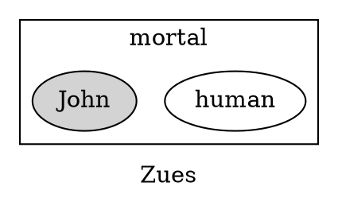

# Takeaway from Section 3.3
$$
\begin{align}
\lnot(\forall x\in D, \exists y\in E, p(x,y)) \equiv& \exists x\in D, \lnot(\exists y\in E, p(x,y)) \\
\equiv& \exists x\in D, \forall y\in E,\lnot p(x,y)
\end{align}
$$
# Section 3.4
````ad-example
All humans are mortal
Zues is not mortal
$\therefore$ Zues is not human

All humans are mortal
John is mortal
$\therefore$ John is human
$$
\begin{align}
T, T \to& T\ \checkmark \\
T, T \to& T\ \checkmark \\
T, T \to& F\ X \\
T, T \to& T\ \checkmark \\
\end{align}
$$
````
# Definitions as provided by the text
![[Universal Instatiation.png]]
![[Universal Modus Ponens.png]]
![[Universal Modus Tollens.png]]
![[Inverse Error.png]]
![[Converse Error.png]]
