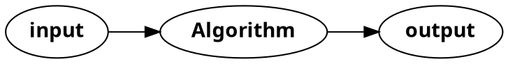

Computer Scientists are interested in the time and space complexity of algorithms
#### Euclidean Algorithm
Given a and b, reduce $\gcd(a,b)$ to $\gcd(c,0)$ 
c is the greatest common divisor of a and b