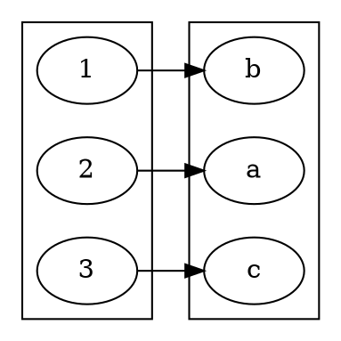

#### Important Notes: $|\mathbb{Z}| = \infty, |\mathbb{R}| = \infty, |\mathbb{Q}| = \infty$
****
## Question 1: Is $\infty + 1 >\infty$
$A =\set{1,2,3,\dots}$
$B = \set{0, 1, 1, 3,\dots}$
$\therefore |A| = |B|$
Let a function f be defined $A\to B$
We can say that $f(x) = x-1$
$\checkmark$ one-to-one if $x_1\neq x_2$ 
	$f(x_1)\neq f(x_2)$
$\checkmark$ onto $\forall y\in B$
	pre-image of $y$ is $y+1$
#### We can conclude that yes, $\infty + 1=\infty$
## Question 2: Is $|\mathbb{Z}|=|\textbf{even}|$
Even $\subseteq\mathbb{Z}$
Let a function f be defined $\mathbb{Z}\to\text{even}$
We can say that $f(x)=2x$
#### We can conclude that $|\mathbb{Z}|=|\textbf{even}|$ 
## Question 3: Is $|\mathbb{Z}|=\mathbb{Q}$
Lemma 1: $|\mathbb{Z}|=|\mathbb{Z}\times\mathbb{Z}|\leftarrow$ Cartesian Product
	Let a function f be defined $\mathbb{Z}\times\mathbb{Z}\to\mathbb{Z}$
	We can say that $f(a,b) = 2^{a-1}(2b-1)$
With this lemma, we can construct a rational number table

| ---          | --- | --- | $\mathbb{Z}$ | --- | --- | ---     |
| ------------ | --- | --- | ------------ | --- | --- | ------- |
| \|           | 1   | 2   | 3            | 4   | 5   | $\dots$ |
| $\mathbb{Z}$ | 1   | 2   | 3            | 4   | 5   | $\dots$ |
| \|           | 1   | 2   | 3            | 4   | 5   | $\dots$ |
If you divide each each value by their respective row number we can say:
$x\in\mathbb{Q},x=\frac{m}{n}\equiv(m,n)\in{\mathbb{Z}\times\mathbb{Z}}$
	We can find this value $x$ in ***columns m, row n***
The table above contains the possible values of $\mathbb{Q}$
	Rational Number Table = $\mathbb{Z}\times\mathbb{Z}$
Lemma 2: $\mathbb{Q}=\mathbb{Z}\times\mathbb{Z}$
## Question 4: Prove $|\mathbb{R}|\neq|\mathbb{Q}|=|\mathbb{Z}|$
````ad-theory
title: Proof by Contradiction
### **Pf/** Assume $|\mathbb{R}| = |\mathbb{Z}|$
Let $s = [0,1]\leftarrow$ Interval
$s\subseteq\mathbb{R}$, $|\mathbb{s}|\ge|\mathbb{R}|$
Assume $|s|=\mathbb{Z}$
	If the cardinalities are equal, then there should exists a [[Relations and Functions|bijectvive]] function $f:\mathbb{Z}\to s$
In the following list, the variables in the decimals represent $\mathbb{Z}^+$
$$
\begin{align}
1\to&0.a_1a_2a_3a_4\dots \\
2\to&0.b_1b_2b_3b_4\dots \\
3\to&0.c_1c_2c_3c_4\dots \\
\vdots \\
\end{align}
$$
#### A Model Bijective function

#### Now construct a new number
$$
\begin{align}
k =& 0.(a_1+1)(b_2+1)(c_3+1)(d_4+1)\dots \\
=& 0.636\dots \in s \\
\text{but } k\neq& 0.a_1a_2\dots \\
\neq& 0.b_1b_2\dots \\
\neq& \dots
\end{align}
$$
#### We can now make a conclusion
$\boxed{|\mathbb{R}|>|\mathbb{Q}|=|\mathbb{Z}|}$ **QED**
*This is a much more advanced proof, just try to understand the basic logic here*
```ad-def
title:Types of Infinity
This proof established modern ideas of infinity
- $|\mathbb{R}|$ is uncountably infinite
- $|\mathbb{Q}|$ and $|\mathbb{Z}|$ are countably infinite
****
We can therefore say that:
$$
\frac{|\mathbb{Q}|\text{ or }|\mathbb{Z}|}{|\mathbb{R}|}\approx 0
$$
We know this is true becuase $\mathbb{R}$ is not countably infinite
****
**Generally:** $\frac{\text{countable}}{\text{uncountable}}\approx 0$ 
```
````
#### $\mathbb{Q}$ is $\underline{\text{dense}}\text{ in }\mathbb{R}$
This means that $\forall x\in\mathbb{R}, x = \lim\limits_{n\to \infty}\set{q_n}$
	Just like $0 = \lim\limits_{n\to \infty}{\frac{1}{n}}$
## Question 5: How many points are on a line or plane
Let...
L is a line
P is a plane
$\star\ |\mathbb{R}| = |\mathbb{R}\times\mathbb{R}|$
#### It seems wrong to fill a plane with a line
	This is because a line is infinitely thin, so how can it add to non-zero
Repeated folding of a one-dimensional object becomes a two-dimensional object as the number of folds approaches infinity. 
	**This question is almost impossible to answer oopsie**